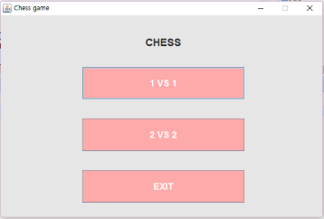
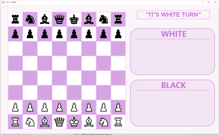
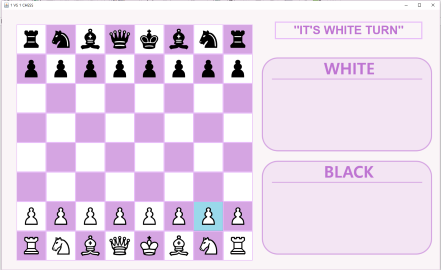
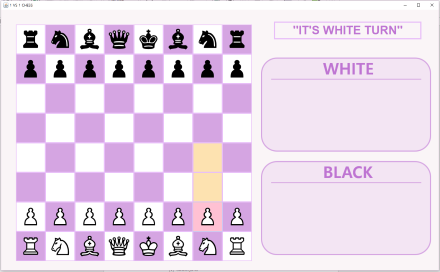
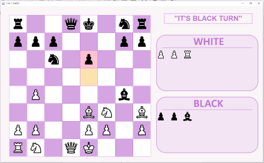
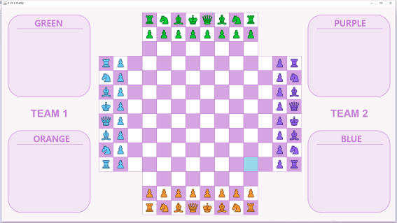
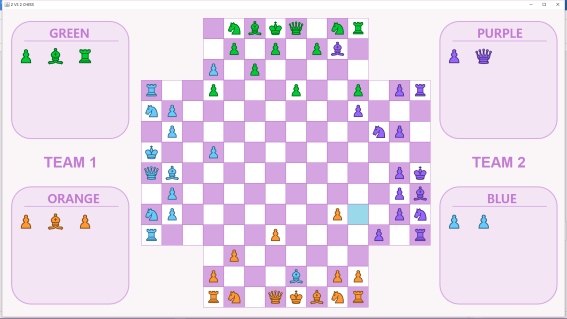

# CHESS Project (2018)

>First screen of program  

## 1vs1 Chess

> Game start screen  

> When cursor over the tile  

> When click the chess piece  

> When a chess piece is caught, it moves as shown in the image  

## 2vs2 Chess

> Game start screen  

> When a chess piece is caught, it moves as shown in the image  
